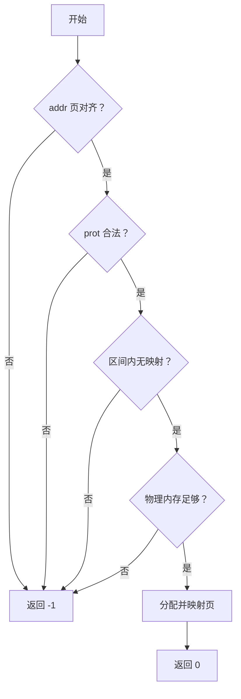

1. ch3 到 ch4 的本质变化
- ch3（无地址空间）：内核和应用程序共享同一物理内存，系统调用直接使用用户传入的指针访问内存，无需检查 —— 内核可以读写任何地方。
- ch4（引入虚拟内存）：每个进程拥有独立的地址空间，用户传入的是虚拟地址，必须通过页表转换成物理地址才能访问。内核不再自动拥有访问用户内存的权限，必须显式检查合法性，否则可能访问到非法区域或内核空间，引发漏洞或崩溃。
2. 地址翻译的必要性
- 虚拟地址需要经过 MMU 硬件翻译，但内核在系统调用中通常用软件方式访问用户内存（如 copy_from_user）。
- 翻译过程中，硬件会检查页表项的权限位（如可读 R、可写 W、用户态可访问 U）。内核必须模拟这一检查，通过 translate 函数获取物理地址并验证权限，确保操作合法。
3. 用户可见/可写检查规则
- 读操作（如 trace 读）：地址必须映射且页表项包含 U（用户可访问）和 R（可读），否则返回 -1。
- 写操作（如 trace 写）：地址必须映射且页表项包含 U 和 W（可写），否则返回 -1。
- 为什么需要 U 位：防止用户程序访问内核空间或其他进程的内存，实现隔离。

4. mmap/munmap 的最小语义
- mmap：分配物理页并建立映射。
- 参数检查：地址页对齐、prot 位合法（仅低3位有效且非0）、区间内无重叠映射、物理内存充足。
- 权限转换：将 prot 的 R/W/X 映射为页表项的对应位，并强制加上 U 位。
- munmap：解除映射并释放物理页。检查区间内所有页是否都已映射，否则返回 -1。

5. 失败分支如何设计
- 系统调用返回 -1 表示错误（无具体错误码）。

- 常见失败场景：
    - 地址未对齐
    - prot 含非法位或权限为空
    - 区间已被占用（mmap）或区间内有空洞（munmap）
    - 物理内存不足（mmap）
# ch4 教程改进建议
增加 trace 系统调用的 ch3 与 ch4 版本对比表
```
版本	        实现方式	                权限检查	        潜在风险
ch3	        直接解引用用户指针	            无	        用户可以传入内核地址，破坏隔离
ch4	    通过 translate 获取物理地址	    需检查 U/R/W	    安全隔离
```

绘制 mmap/munmap 参数校验流程图

用流程图清晰展示 mmap 的检查步骤：

munmap 类似，但检查区间内所有页是否已映射。

提供“prot 位非法/地址未对齐/区间重叠”的排错表

常见错误、原因及解决方法：
```
错误现象	        可能原因	                调试方法
mmap 返回 -1	addr 未按页对齐	        检查 addr 是否为 4KB 倍数
mmap 返回 -1	prot 包含高 29 位非 0	检查 prot 是否只使用了低 3 位
mmap 返回 -1	prot & 0x7 == 0	        必须至少有一种权限
mmap 返回 -1	区间与已有映射重叠	    使用 addr_space.translate 检查
munmap 返回 -1	区间内有未映射页	        遍历区间，确保每个页都映射过
```

增加 FAQ 部分

例如：

Q: 为什么 RISC-V 中可写页必须同时可读？
A: 硬件规定，页表项中 W=1 时 R 必须也为 1，否则视为非法。

Q: translate 返回错误时，为什么直接返回 -1 而不是 panic？
A: 这是系统调用的正常错误处理，用户程序应能处理权限错误。


同学们好！今天我们要讨论：为什么在第四章引入地址空间后，系统调用必须做权限检查？这就像你住进了独立房间（地址空间），别人不能随便进你房间拿东西。
回顾第三章
第三章没有地址空间，内核和程序像在大通铺里，任何代码都能访问任何内存。系统调用里，用户给个指针，内核直接读写，不用检查——因为内核就是老大，哪里都能去。但这不安全，用户程序可以故意传个内核地址搞破坏。
第四章的变化
现在每个进程有自己的地址空间，用户给的地址是虚拟地址，需要翻译成物理地址。翻译时要看“门牌”（页表项）上有没有写“允许用户进入”（U位）。内核不能再直接闯进去，必须先问页表：“这个地址合法吗？能读吗？能写吗？”
trace 的例子
比如 trace 系统调用，读操作（request=0）时，内核必须调用 translate 检查地址是否映射且可读（R位）且用户可访问（U位）。如果缺一个，就返回 -1。写操作同理，还要检查可写（W位）。这就像你要进别人房间拿书，得先确认门没锁而且你被允许进去。
mmap 和 munmap
mmap 申请内存时，内核要分配物理页，建立映射。但得先检查参数：地址要对齐（4KB）、权限位不能乱填（比如不能只有执行没有读）、区间不能重叠。最后映射时，一定要加上 U 位，否则用户自己都访问不了。
munmap 释放时，得确保区间里的每一页都映射过，否则返回 -1。这就像你要退房，得确认每个房间你都租了，不能退别人的房间。
错误处理
所有检查失败都返回 -1。虽然实验简化了，但真实系统会返回具体错误码（比如 EINVAL）。记住：权限检查不是为了为难你，而是为了隔离和安全。
结尾
总结一下：地址空间引入了隔离，系统调用必须通过页表验证用户地址的合法性，否则隔离就形同虚设。下次你写系统调用时，记得先问问页表：“这个地址能碰吗？