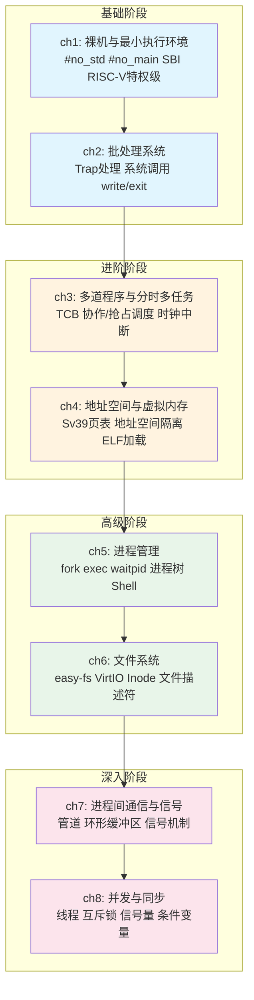
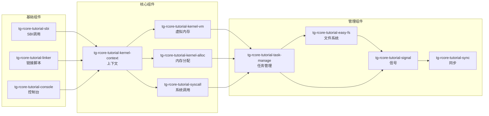

# tg-rcore-tutorial 操作系统学习路径总结

本教程基于 tg-rcore-tutorial-ch1-8 系列仓库，系统化地讲解操作系统内核的逐步演进过程。

## 一、学习路径总览

本教程共分为8个章节，从最基础的裸机编程开始，逐步构建完整的操作系统内核：

| 章节 | 主题 | 核心知识点 |
|:---:|:---|:---|
| ch1 | 裸机与最小执行环境 | 应用程序执行环境、裸机编程、SBI、RISC-V特权级 |
| ch2 | 批处理系统 | 批处理、特权级切换、Trap处理、系统调用 |
| ch3 | 多道程序与分时多任务 | 任务控制块、协作/抢占式调度、时钟中断、时间片轮转 |
| ch4 | 地址空间与虚拟内存 | Sv39三级页表、地址空间隔离、页表、地址转换 |
| ch5 | 进程管理 | 进程、fork/exec/waitpid、进程树、调度算法 |
| ch6 | 文件系统 | easy-fs、VirtIO块设备、文件描述符、Inode |
| ch7 | 进程间通信与信号 | 管道、环形缓冲区、信号机制 |
| ch8 | 并发与同步 | 线程、互斥锁、信号量、条件变量、死锁 |

---

## 二、思维导图



---

## 三、各章节详细内容

### 第1章：裸机与最小执行环境

**目标**：实现最简单的 RISC-V S态裸机程序

**核心知识点**：
- 应用程序执行环境
- 裸机编程（Bare-metal）
- SBI（Supervisor Binary Interface）
- RISC-V 特权级（M/S-mode）
- 链接脚本（Linker Script）
- 内存布局（Memory Layout）
- Panic 处理

**主要功能**：
- 最小 S-mode 裸机程序
- QEMU 直接启动（无 OpenSBI）
- 打印 "Hello, world!" 并关机
- 演示最基本的 OS 执行环境

**依赖组件**：tg-rcore-tutorial-sbi

---

### 第2章：批处理系统

**目标**：实现能够依次加载并运行多个用户程序的批处理操作系统

**核心知识点**：
- 批处理系统（Batch Processing）
- 特权级切换（U-mode ↔ S-mode）
- Trap 处理（ecall / 异常）
- 上下文保存与恢复
- 系统调用（write / exit）
- 用户态 / 内核态

**主要功能**：
- 批处理操作系统
- 顺序加载运行多个用户程序
- 特权级切换和 Trap 处理框架
- 实现 write / exit 系统调用

**依赖组件**：tg-rcore-tutorial-sbi, tg-rcore-tutorial-linker, tg-rcore-tutorial-console, tg-rcore-tutorial-kernel-context, tg-rcore-tutorial-syscall

---

### 第3章：多道程序与分时多任务

**目标**：支持多个用户程序同时驻留内存并发执行

**核心知识点**：
- 多道程序（Multiprogramming）
- 任务控制块（TCB）
- 协作式调度（yield）
- 抢占式调度（Preemptive）
- 时钟中断（Clock Interrupt）
- 时间片轮转（Time Slice）
- 任务切换（Task Switch）
- 任务状态（Ready/Running/Finished）

**主要功能**：
- 多道程序与分时多任务
- 多程序同时驻留内存
- 协作式 + 抢占式调度
- 时钟中断与时间管理

**新增系统调用**：
- `sched_yield` (124)：主动让出CPU
- `clock_gettime` (113)：获取当前时间

**依赖组件**：在ch2基础上增加任务调度相关组件

---

### 第4章：地址空间与虚拟内存

**目标**：引入 RISC-V Sv39 虚拟内存机制，为每个用户进程提供独立的地址空间

**核心知识点**：
- 虚拟内存（Virtual Memory）
- Sv39 三级页表（Page Table）
- 地址空间隔离（Address Space）
- 页表项（PTE）与标志位
- 地址转换（VA → PA）
- 异界传送门（MultislotPortal）
- ELF 加载与解析
- 堆管理（sbrk）
- 恒等映射（Identity Mapping）
- 内存保护（Memory Protection）

**主要功能**：
- 引入 Sv39 虚拟内存
- 每个用户进程独立地址空间
- 跨地址空间上下文切换
- 进程隔离和内存保护

**新增/修改系统调用**：
- `sbrk` (214)：调整堆大小

**依赖组件**：tg-rcore-tutorial-kernel-alloc, tg-rcore-tutorial-kernel-vm

---

### 第5章：进程管理

**目标**：实现完整的进程管理机制，支持 fork/exec/waitpid 等系统调用

**核心知识点**：
- 进程（Process）
- 进程控制块（PCB）
- 进程标识符（PID）
- fork（地址空间深拷贝）
- exec（程序替换）
- waitpid（等待子进程）
- 进程树 / 父子关系
- 初始进程（initproc）
- Shell 交互式命令行
- 进程生命周期（Ready/Running/Zombie）
- 步幅调度（Stride Scheduling）

**主要功能**：
- 引入进程管理
- fork / exec / waitpid 系统调用
- 动态创建、替换、等待进程
- Shell 交互式命令行

**依赖组件**：tg-rcore-tutorial-task-manage

---

### 第6章：文件系统

**目标**：引入文件系统与 I/O 支持，用户程序存放在磁盘镜像中

**核心知识点**：
- 文件系统（File System）
- easy-fs 五层架构
- SuperBlock / Inode / 位图
- DiskInode（直接+间接索引）
- 目录项（DirEntry）
- 文件描述符表（fd_table）
- 文件句柄（FileHandle）
- VirtIO 块设备驱动
- MMIO（Memory-Mapped I/O）
- 块缓存（Block Cache）
- 硬链接（Hard Link）

**主要功能**：
- 引入文件系统与 I/O
- 用户程序存储在磁盘镜像（fs.img）
- VirtIO 块设备驱动
- easy-fs 文件系统实现
- 文件打开 / 关闭 / 读写

**新增系统调用**：
- `open` (56)
- `close` (57)
- `read` (63)
- `write` (扩展)

**依赖组件**：tg-rcore-tutorial-easy-fs

---

### 第7章：进程间通信与信号

**目标**：实现管道和信号两大 IPC 机制

**核心知识点**：
- 进程间通信（IPC）
- 管道（Pipe）
- 环形缓冲区（Ring Buffer）
- 统一文件描述符（Fd 枚举）
- 信号（Signal）
- 信号集（SignalSet）
- 信号屏蔽字（Signal Mask）
- 信号处理函数（Signal Handler）

**主要功能**：
- 进程间通信-管道
- 异步事件通知（信号）
- 统一文件描述符抽象
- 信号发送 / 注册 / 屏蔽 / 返回

**新增系统调用**：
- `pipe` (59)：创建管道
- `kill` (129)：发送信号
- `sigaction` (134)：注册信号处理函数
- `sigprocmask` (135)：设置信号屏蔽字
- `sigreturn` (139)：信号返回
- `dup` (23)：I/O 重定向

**依赖组件**：tg-rcore-tutorial-signal, tg-rcore-tutorial-signal-impl

---

### 第8章：并发与同步

**目标**：引入线程和同步原语，支持同一进程内的多线程并发

**核心知识点**：
- 同步互斥（Sync & Mutex）
- 线程（Thread）/ 线程标识符（TID）
- 进程-线程分离
- 竞态条件（Race Condition）
- 临界区（Critical Section）
- 互斥（Mutual Exclusion）
- 互斥锁（Mutex：自旋锁 vs 阻塞锁）
- 信号量（Semaphore：P/V 操作）
- 条件变量（Condvar）
- 管程（Monitor：Mesa 语义）
- 线程阻塞与唤醒（wait queue）
- 死锁（Deadlock）/ 死锁四条件

**主要功能**：
- 进程-线程分离
- 同一进程内多线程并发
- 互斥锁（MutexBlocking）
- 信号量（Semaphore）
- 条件变量（Condvar）
- 线程阻塞与唤醒机制

**新增系统调用**：
- `thread_create` (1000)：创建线程
- `gettid` (1001)：获取线程ID
- `waittid` (1002)：等待线程
- `mutex_create` (1010)：创建互斥锁
- `mutex_lock` (1011)：获取互斥锁
- `mutex_unlock` (1012)：释放互斥锁
- `sem_create` (1020)：创建信号量
- `sem_post` (1021)：V操作
- `sem_wait` (1022)：P操作

**依赖组件**：tg-rcore-tutorial-sync

---

## 四、推荐学习顺序

```
第一阶段：基础 → ch1 → ch2
  ├── 跑通启动、Trap、基础 syscall

第二阶段：进阶 → ch3 → ch4
  ├── 完成任务调度到地址空间

第三阶段：高级 → ch5 → ch6
  ├── 完成进程与文件系统

第四阶段：深入 → ch7 → ch8
  ├── 完成 IPC、线程与并发同步
```

---

## 五、内核组件依赖关系



---

## 六、环境要求

- **Rust 工具链**：stable（要求 >= 1.85.0，支持 edition 2024）
- **目标架构**：riscv64gc-unknown-none-elf
- **QEMU**：qemu-system-riscv64（建议 >= 7.0）
- **推荐工具**：cargo-binutils、cargo-clone、llvm-tools

---

## 七、快速开始

```bash
# 克隆完整仓库
git clone --recurse-submodules https://github.com/rcore-os/tg-rcore-tutorial.git
cd tg-rcore-tutorial

# 进入第3章（推荐入门章节）
cd tg-rcore-tutorial-ch3

# 编译运行
cargo run

# 运行测试
./test.sh base
```

---

## 八、参考资源

- [rCore-Tutorial-Guide](https://learningos.github.io/rCore-Tutorial-Guide/)
- [rCore-Tutorial-Book](https://rcore-os.cn/rCore-Tutorial-Book-v3/)
- [RISC-V Privileged Specification](https://riscv.org/specifications/privileged-isa/)
- [RISC-V SBI Specification](https://github.com/riscv-non-isa/riscv-sbi-doc)
